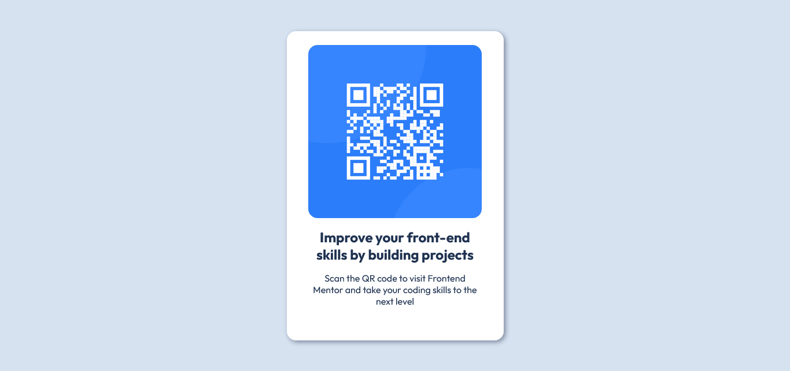

# Frontend Mentor - QR code component solution

This is a solution to the [QR code component challenge on Frontend Mentor](https://www.frontendmentor.io/challenges/qr-code-component-iux_sIO_H).

- [Overview](#overview)
  - [Screenshot](#screenshot)
  - [Links](#links)
- [My process](#my-process)
  - [Built with](#built-with)
  - [What I learned](#what-i-learned)
- [Author](#author)

## Overview

### Screenshot



### Links

- Live Site URL: [https://syjem.github.io/qr-code-component/](https://syjem.github.io/qr-code-component/)

## My process

### Built with

- Semantic HTML5 markup
- CSS custom properties
- Flex-box
- Mobile-first workflow

### What I learned

    1. Writing README.md comprehensive guide
    2. CSS custom properties

```css
:root {
  --ff: "Outfit", sans-serif;
  --fw-reg: 400;
  --fw-bold: 700;

  --clr-text: hsl(218, 44%, 22%);
  --clr-bg: hsl(212, 45%, 89%);
  --clr-white: hsl(0, 0%, 100%);
  --clr-grayish-blue: hsl(220, 15%, 55%);
}
```

## Author

- Frontend Mentor - [@syjem](https://www.frontendmentor.io/profile/syjem)
